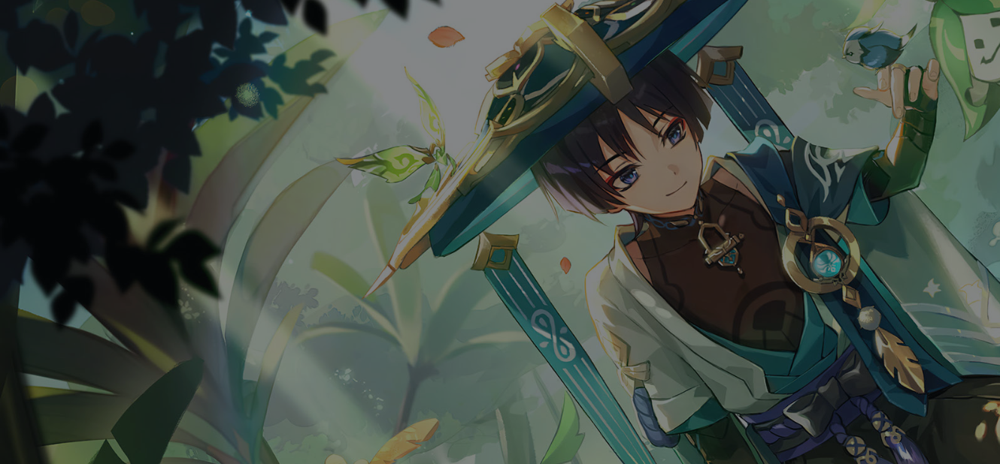
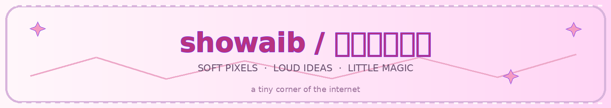
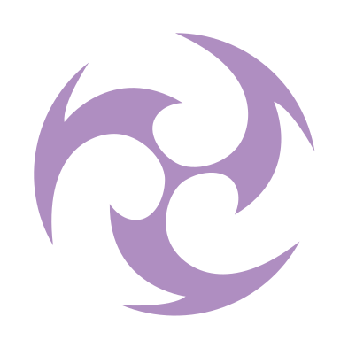
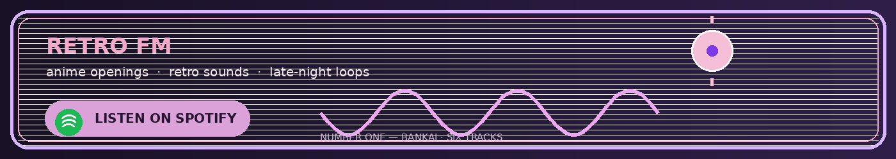
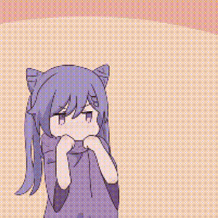

  

  <a href="https://github.com/Shoislam0311">github</a>
  &nbsp;·&nbsp;
  <a href="https://www.aniraku.tech/">aniraku</a>
  &nbsp;·&nbsp;
  <a href="mailto:sho.islam0311@gmail.com">say hi</a>
  &nbsp;·&nbsp;
  <a href="https://raw.githack.com/Shoislam0311/Shoislam0311/main/docs/index.html">music room</a>

  
  &nbsp;&nbsp;
  
  &nbsp;&nbsp;
  

somewhere between a clean UI and a very unnecessary anime reference

  <b>Hey, I’m Showaib.</b> 
  I build web stuff, APIs, and little experiments that usually start with 
  “wait, this would actually be useful.”

  I’m from Bangladesh, I make <a href="https://www.aniraku.tech/">Aniraku</a>, and I like software 
  that feels fast, simple, and a little bit alive. Anime, music, and late-night ideas 
  tend to sneak into the things I build.

<h3 align="center">things i reach for</h3>

<a href="https://raw.githack.com/Shoislam0311/Shoislam0311/main/docs/index.html">open the six-track anime playlist</a> · six Spotify embeds, one track at a time

  

  

 

made with code, curiosity, and a mildly concerning number of tabs.

