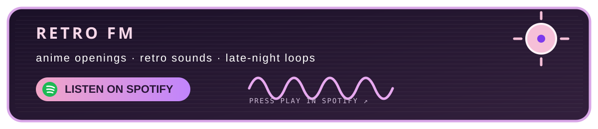

  

  <a href="https://github.com/Shoislam0311">github</a>
  &nbsp;·&nbsp;
  <a href="https://www.aniraku.tech/">aniraku</a>
  &nbsp;·&nbsp;
  <a href="mailto:sho.islam0311@gmail.com">say hello</a>
  &nbsp;·&nbsp;
  <a href="https://open.spotify.com/user/31pxuilycotlyuaehfphqimevlaq">my music</a>

  
  
  

૮ ˶ᵔ ᵕ ᵔ˶ ა welcome to my little corner of the internet

## hi, i'm showaib

> an open-source developer from Bangladesh making web things, API things, and occasionally overthinking a button for three hours.

I like interfaces with a little soul, code that stays readable after the dopamine wears off, and side projects that start as “this would be funny” and somehow become real. My current main-character arc is **Aniraku**: anime discovery and watching, built with care for both web and Android.

I’m usually somewhere between frontend polish, backend systems, deployment rabbit holes, anime, and music that makes the room feel like a different decade.

---

## tiny status board

| mood | current arc | energy |
| --- | --- | --- |
| soft pixels | building Aniraku | quietly locked in |
| anime brain | learning better systems | one more commit |
| late-night mode | making the UI feel right | pookie but productive |

---

## little toolbox

currently collecting better ideas, cleaner components, and fewer unnecessary dependencies

---

## retro fm

<a href="https://shoislam0311.github.io/Shoislam0311/">open the real player</a> · <a href="https://open.spotify.com/track/1nThz7yEG2vbyI4UmInj5z?utm_source=generator&theme=0&si=867079b581c64263">open directly in Spotify</a>

---

  

  

 

made with code, curiosity, and too many browser tabs.

