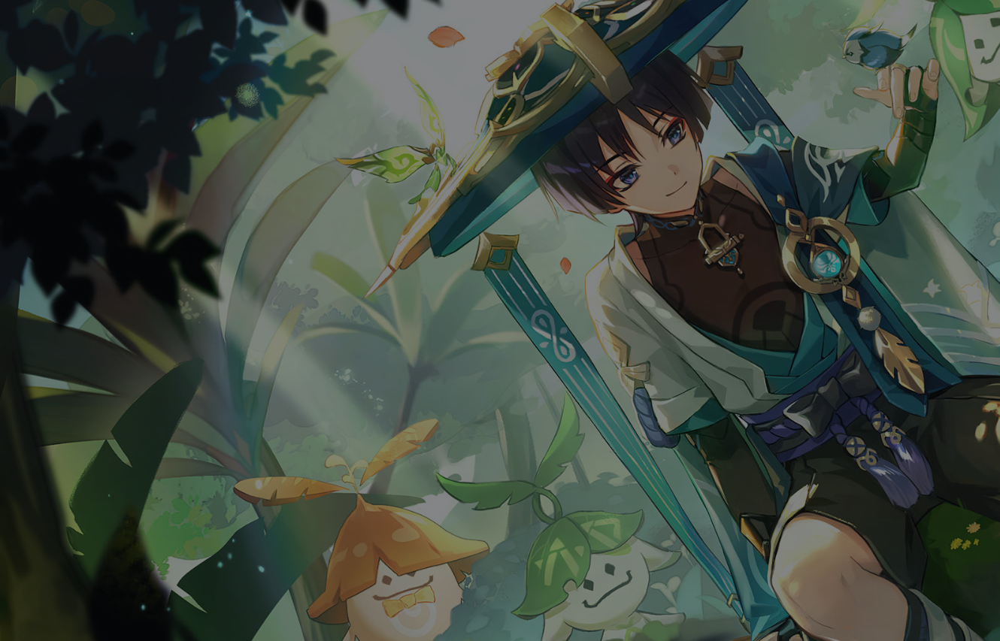
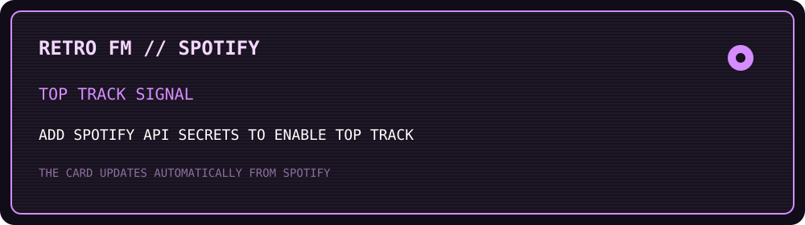

 

<h1>showaib / しょうあいぶ</h1>

<i>building small worlds with code, pixels, and a little bit of anime magic.</i>

  <a href="https://github.com/Shoislam0311?tab=repositories">repositories</a>
  &nbsp;·&nbsp;
  <a href="https://www.aniraku.tech/">aniraku</a>
  &nbsp;·&nbsp;
  <a href="mailto:sho.islam0311@gmail.com">say hello</a>

  
  
  

> **Showaib Islam** — a developer from Bangladesh making web products, APIs, and personal projects with a soft spot for thoughtful interfaces and weirdly ambitious side projects.

I like building things that feel good to use and still make sense when somebody opens the code later. Most of my work lives somewhere between frontend polish, backend services, data, deployment, and the long process of turning an idea into something real.

## currently in my little workshop

| signal | what it means |
|:--|:--|
| `building` | **Aniraku** — an open-source anime discovery and viewing platform for web and Android |
| `learning` | better product engineering, backend architecture, deployment, and maintainable systems |
| `into` | anime, music, clean UI, tiny details, and shipping things instead of only talking about them |

## aniraku / anime, thoughtfully built

**Aniraku** brings discovery and watching into one focused place: catalog browsing, schedules, recommendations, playback, watch history, ratings, bookmarks, comments, and progress tracking. The public web project uses `React`, `Vite`, `Artplayer`, `HLS.js`, `AniList`, and `Supabase`; the Android project has its own player, library, history, relationships, provider controls, and Android 9+ distribution path.

## selected episodes

### [Sikder Villa & Resort](https://sikder-three.vercel.app/)

A responsive resort experience for a property in Kuakata, Bangladesh, covering rooms, dining, events, wellness, gallery content, contact, and reservations.

`Next.js` · `React` · `TypeScript` · `Tailwind CSS` · `Prisma` · `SQLite`

[visit the live site](https://sikder-three.vercel.app/) &nbsp;·&nbsp; [read the source](https://github.com/Shoislam0311/Sikder)

### [Birthday Portfolio](https://birthday-portfolio-for-my-sis.vercel.app/)

A personal birthday website for my sister with messages, photos, motion, interactive wishes, cards, dialogs, and a responsive layout built around one memorable day.

`React` · `TypeScript` · `Vite` · `Tailwind CSS` · `Framer Motion`

[visit the live site](https://birthday-portfolio-for-my-sis.vercel.app/) &nbsp;·&nbsp; [read the source](https://github.com/Shoislam0311/Birthday-Portfolio-for-My-Sis)

### [Miruro API V3](https://miruro-api-v3.onrender.com/)

A small deployable Python service with FastAPI and configuration paths for Vercel, Railway, Render, Docker, and Replit.

`Python` · `FastAPI` · `Docker` · `Uvicorn`

[open the deployment](https://miruro-api-v3.onrender.com/) &nbsp;·&nbsp; [read the source](https://github.com/Shoislam0311/miruro-api-v3)

## tools in my inventory

## retro fm / my spotify top track

The top-track card is generated by the repository’s scheduled workflow from Spotify’s `user-top-read` data. The public Spotify profile ID alone cannot reveal private top-track data, so the workflow is intentionally ready for the three Spotify credentials to be added as repository secrets.

## contribution trail

## tiny archive of references

The decorative artwork in `assets/reference/` was downloaded from the public profile repositories and README asset links supplied as references. Source credits are recorded in [`assets/reference/SOURCES.md`](./assets/reference/SOURCES.md).

 

 

made with code, curiosity, and too many browser tabs.

